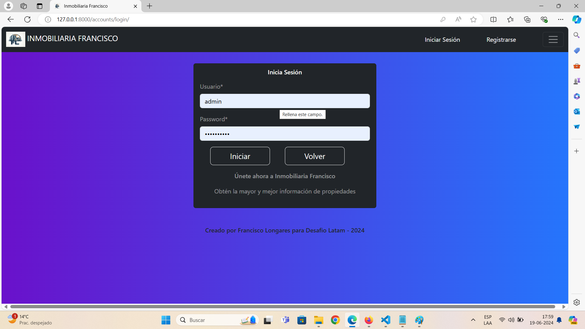
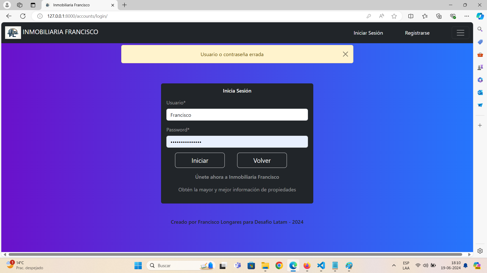
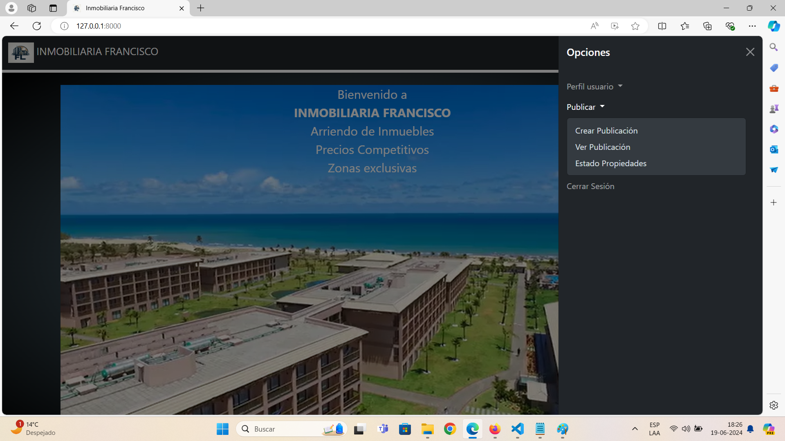
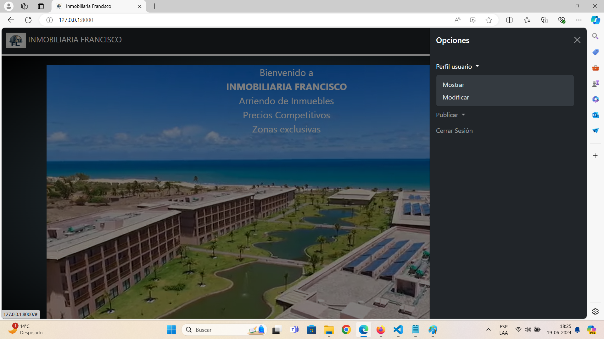
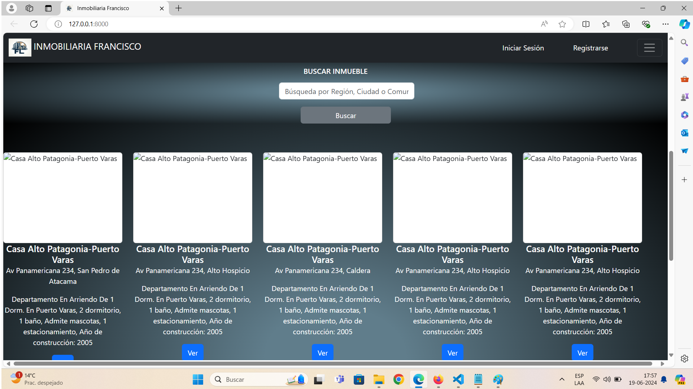
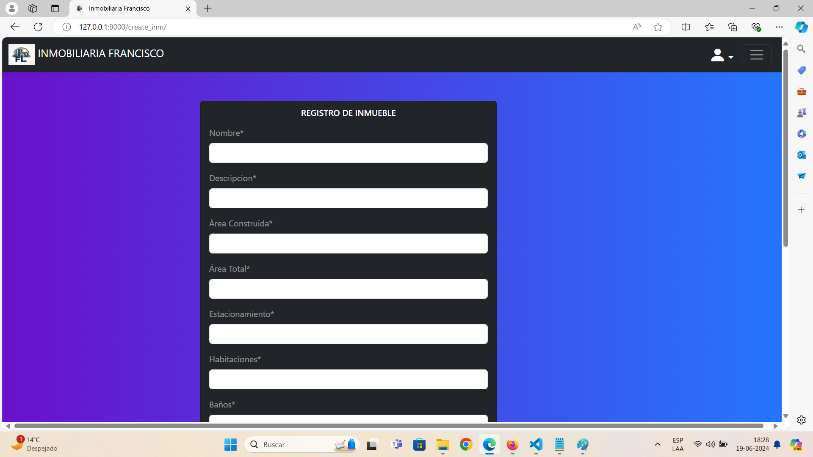
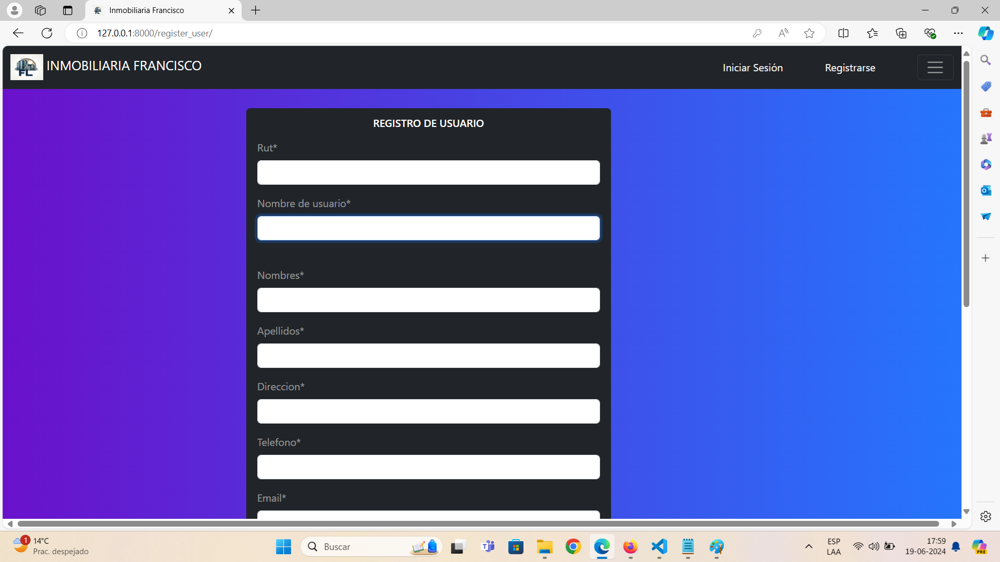
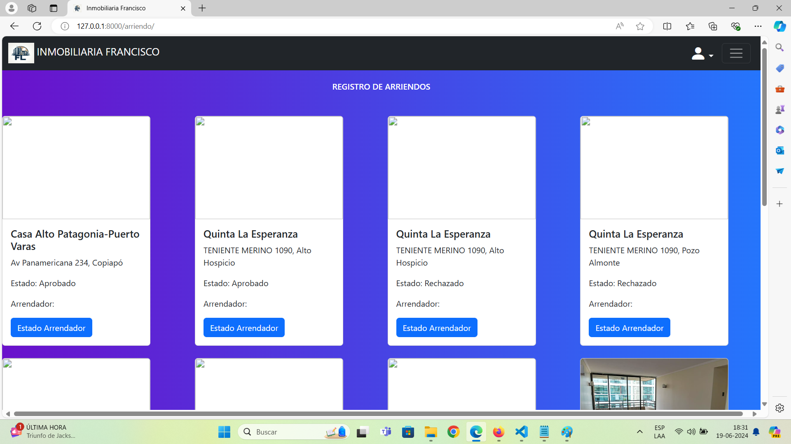

# Property lease management system

System for the management of real estate leasing, among the functionalities is the registration of real estate, registration of lessors and tenants, rental requests by lessors, and the approval or not of the leases by the lessee.

## Project description

Web application for the management of real estate properties, landlords and tenants. Features: User registration: Tenants and lessors. Editing of tenant and lessor data. User login. Property registration only for tenants. Properties can be hidden. Editing property data. Gallery of images and property information. Landlords may request property approval from the Tenant. The Tenant may accept the Landlord interested in any property.

## Project Screenshots

Incluir capturas de pantalla o imágenes que muestren el proyecto en funcionamiento.

![Home] (img/init.png)
        (img/init-2.png)
        (img/init-3.png)
Application home view.


Application loging.


Application success warning messages.


Application post.


Application profile.


Application gallery.


Application register.


Application register.


Application status property.

## Prerequisites or Dependencies

List of software and tools, including versions, you need to install and run this project:

- Programming language: Python 3.12.2
- Framework: Django 5.0.4
- Database: PostgreSQL 16
- Library: crispy-bootstrap5==2024.2, django-crispy-forms==2.1, psycopg==3.1.18, sqlparse==0.5.0, typing_extensions==4.11.0, tzdata==2024.1, asgiref==3.8.1, django-environ==0.11.2

## Project Installation

Step by step guide on how to set up development environment and install all dependencies.

```bash
# Step 1
```
Clone the repository using Git:

```bash
# paso 2
```
pip install virtualenv, django, django-environ, Pillow
pip install -r requirements-inmobiliaria.txt

## Instructions to Execute the Project

Instructions to run the project once installed.

```bash
# Step 1
```
cd .venv
cd Scripts
.\activate
cd..
cd..
cd inmobiliaria
python .\manage.py runserver
Starting development server at http://127.0.0.1:8000/

## Instructions for Loading the Database or Migrating Models

Instructions needed to load the database or migrate data models.

```bash
# Step 1
```
config settings.py
DATABASES = {
    'default': {
        'ENGINE': 'django.db.backends.postgresql',
        'NAME': env('DB_NAME'),
        'USER': env('DB_USER'),
        'PASSWORD': env('DB_PASSWORD'),
        'HOST': env('DB_HOST'),
        'PORT': env('DB_PORT'),
    }
}
python manage.py makemigrations
python manage.py migrate
python manage.py createsuperuser

## Author

- [Francisco Longares](https://github.com/longaresf)
